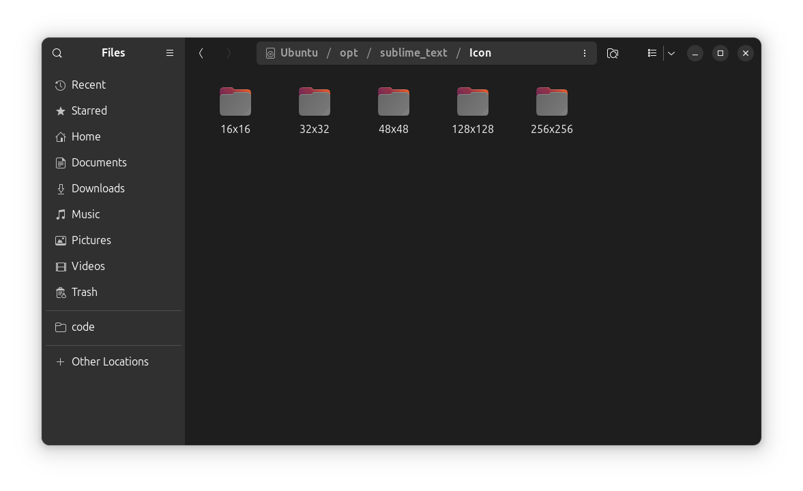
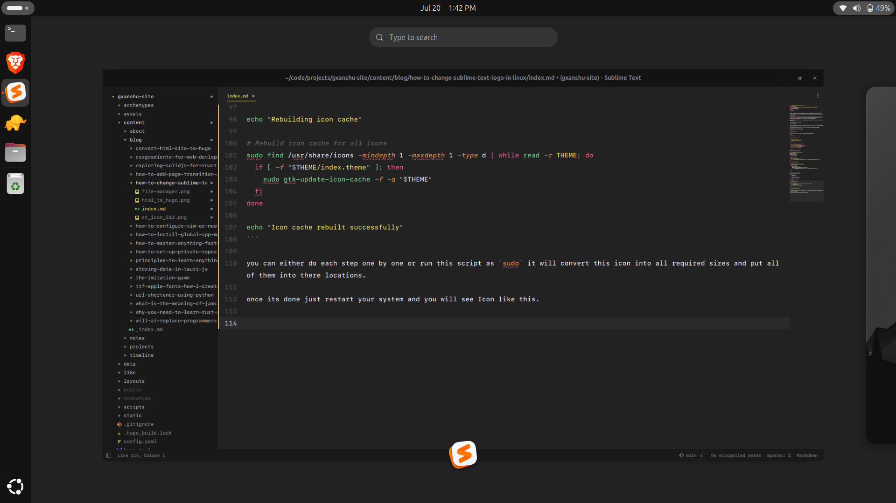

Honestly i love sublime text. It's the fastest code editor in the market, I'm working with sublime text from years now and customize it in many ways to make it feel more awesome. In today's article we gonna change icon of sublime text in Linux machines.

## Folder Structure

All the applications in Linux provides a folder of icon sets to use in many different cases. uselessly we need an icon set of `16x16`, `32x32`, `48x48`, `128x128` and `256x256`. we can either use online tools to generate these sizes for us or we can use command line tools like [image-magic](https://imagemagick.org/index.php). we gonna use image-magic.

Sublime text install itself in `/opt/sublime-text` folder. and icons can be found in `/opt/sublime-text/icons`. as you can see in following image.



## Assets & dependencies

Don't worry i will not make you write code ;). i created a script for you, you can just install dependecies and download required assets and you are good to go.

first of all download New [Sublime Text Icon](st_icon_512.png) in any Directory. (Download folder is recommended)

then install image magic from your package manager.

```sh
sudo apt install imagemagick
```

now create a new file as `script.sh` in the same folder where you have the Sublime Text icon.

```sh
#!/usr/bin/env bash
##
## Replace Sublime Text icons in Ubuntu
##

if [ "$(whoami)" != "root" ]; then
    echo "Script must be run as root, e.g."
    echo sudo "$0"
    exit 1
fi

# Check if imagemagick is installed. If not, install.
if ! dpkg -s imagemagick >/dev/null 2>&1; then
    echo "Imagemagick not installed. Installing imagemagick"
    sudo apt-get --force-yes --yes install imagemagick
else
    echo "Imagemagick is already installed."
fi

# The directory this script is running in
THIS_DIR="$(dirname "$(realpath "$0")")"

echo "Creating Sublime Text icon set for Ubuntu"
# Convert icons and move into folders
TEMP_DIR="$THIS_DIR/TEMP"
TEMP_ICONS="$TEMP_DIR/Icon"
# shellcheck disable=SC2174
mkdir -p -m755 "$TEMP_ICONS"

# Convert icons
for SIZE in 256 128 48 32 16; do
    mkdir -p "$TEMP_ICONS/${SIZE}x${SIZE}"
    convert -resize "${SIZE}x${SIZE}" "${THIS_DIR}/st_icon_512.png" "${TEMP_ICONS}/${SIZE}x${SIZE}/sublime-text.png"
done

echo "Updating Sublime Text icons"

# Replace theme icons in all default locations
for dir in /usr/share/icons/*/ ~/.local/share/icons/*/; do
    ICON_DIRECTORY=${dir%*/}
    # Replace all icon sizes
    for SIZE in 256 128 48 32 16; do
        ICON_SIZE_DIRECTORY="${ICON_DIRECTORY}/${SIZE}x${SIZE}/apps/"
        if [ -d "$ICON_SIZE_DIRECTORY" ]; then
            cp -f "${TEMP_ICONS}/${SIZE}x${SIZE}/sublime-text.png" "${ICON_SIZE_DIRECTORY}/sublime-text.png"
        fi
    done
done

# Replace default Sublime Text 2 icons
SUBLIME_ICONS="/opt/sublime_text/Icon/"

# Remove existing icons
rm -rf "$SUBLIME_ICONS"

# Move new icons into place
cp -rp "$TEMP_ICONS" "$SUBLIME_ICONS"

# Remove temporary icon directory
rm -rf "$TEMP_DIR"

echo "Rebuilding icon cache"

# Rebuild icon cache for all icons
sudo find /usr/share/icons -mindepth 1 -maxdepth 1 -type d | while read -r THEME; do
  if [ -f "$THEME/index.theme" ]; then
    sudo gtk-update-icon-cache -f -q "$THEME"
  fi
done

echo "Icon cache rebuilt successfully"
```

you can either do each step one by one or run this script as `sudo` it will convert this icon into all required sizes and put all of them into there locations.

once its done just restart your system and you will see Icon like this.



Thank you for reading. if you face any problem let me know.

ref := [Github](https://gist.github.com/gxanshu/8c60aad3c5b300cf49ec1c0b4ab5a301)